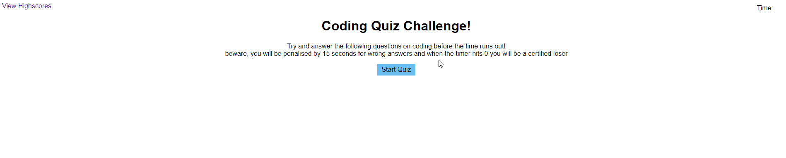

# Quiz

## Motivation

I wanted to make this quiz the best it possibly could be. To push and flex my gained knowledge of JavaScript, html, CSS and now API's to its limit and I believed this is the result of how much I could do in a week, while juggling school and work

## Problems

Beginning this project I had underestimated how much planning needed to go into my html page to then be able to call everything through my JS. This was definitly a learning experience in that now I understand better how to build and structure a dynamic html page.
It was seemingly one step forwards and two steps backwards for a minute with this project, as things like my dyslexia causing me to misspell all of my classes and the worst was trying to match the correct answers in the for loops as I constantly mistyped.

I ran into many issues with my Interval just not working and after utilizing askBSC I was able to learn something about Intervals that I didnt understand at first! Basically - telling the function that eventually it will need to stop

## Learnings

I learnt so much during this challenge I am not sure where to begin. I think the biggest and most important thing I learned is that asking for help is okay and extremely important. I reached out to the askBCS team a fair few times, more than I thought I ever would and in doing so think I learnt a lot more about coding and about myself in the process

## The App

This link https://virgona.github.io/Quiz/ will take you to a webpage where you can partake in a coding quiz. You will be timed for 75 seconds and you will lose 15 seconds for each wrong answer you select. At the end of the quiz the user will be prompted to enter their initials and register their highscore!

